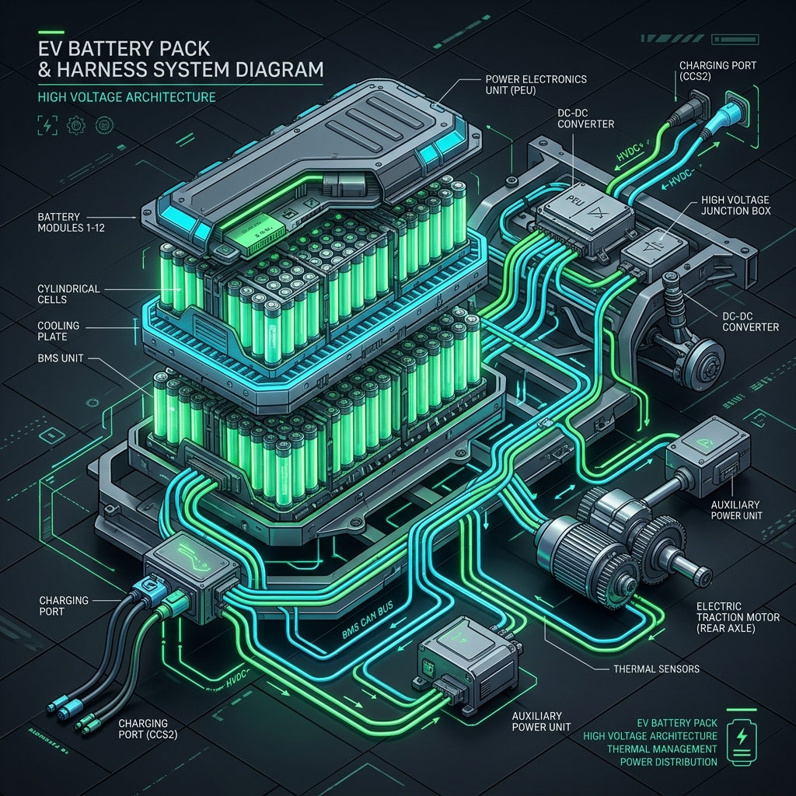

# 🏎️ ET AutoTech Hackathon 2026 Platform

[](https://github.com/parmarjh/ET-AutoTech-Hackathon-2026-/actions/workflows/deploy.yml)

**Live Demo**: [https://parmarjh.github.io/ET-AutoTech-Hackathon-2026-/](https://parmarjh.github.io/ET-AutoTech-Hackathon-2026-/)

Welcome to the **ET AutoTech 2026** AI-Powered Automotive Innovation Platform! This project showcases 5 production-ready AI solutions across the automotive value chain, built with React, Vite, and cutting-edge frontend technologies.



## 🌟 The Themes

The platform features fully interactive dashboards and 3D visual simulations for five distinct problem statements:

1. **Resilient Supply Chains & Smart Manufacturing**
   AI-powered anomaly detection, risk forecasting, and 3D network mapping.
2. **EV Retrofit & Conversion Ecosystem**
   3D isometric wiring harness scanner and battery configuration diagnostics.
3. **ADAS Adoption in India**
   Live ADAS telemetry dashboard, pulsing driver trust index, and road risk scoring.
4. **Seamless EV Charging Ecosystem**
   Route optimization and ONDC network monitor with a glowing 3D map.
5. **Circular Economy & Sustainability**
   Material extraction process simulation, circular recycling dashboards, and carbon footprint tracking.

## 🚀 Tech Stack

- **Frontend Framework**: React 18
- **Build Tool**: Vite
- **Styling**: Vanilla CSS with custom Glassmorphism & Cyberpunk aesthetics
- **Icons**: Lucide React
- **Animations**: CSS Keyframes & dynamic React state transitions

## 🛠️ Getting Started

### Prerequisites

Make sure you have [Node.js](https://nodejs.org/) installed on your machine.

### Installation

1. Clone the repository:
   ```bash
   git clone https://github.com/parmarjh/ET-AutoTech-Hackathon-2026.git
   ```
2. Navigate into the directory:
   ```bash
   cd ET-AutoTech-Hackathon-2026
   ```
3. Install dependencies:
   ```bash
   npm install
   ```
4. Start the development server:
   ```bash
   npm run dev
   ```
5. Open your browser and navigate to `http://localhost:3000/`.

## 🎨 UI/UX Highlights

- **Dynamic Interactive States**: Progress bars, scanning simulations, and dynamic revealing metrics.
- **Glassmorphism Design**: Sleek, modern cards with blur and vibrant gradient borders.
- **Micro-interactions**: Hover effects, button spinners, and animated 3D assets that respond to user input.

---
*Built by Shiva AI LLP for the ET AutoTech Hackathon 2026.*
